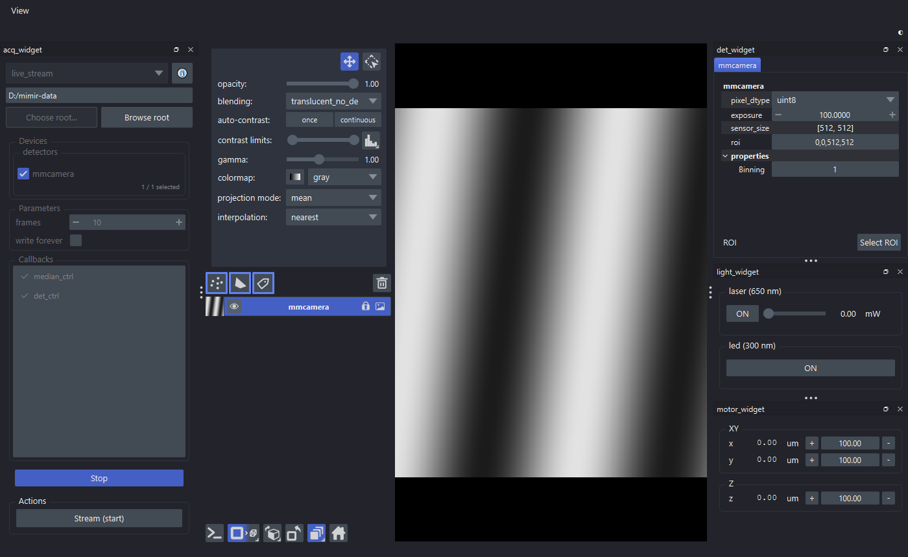

# redsun-mimir

[](https://github.com/redsun-acquisition/redsun-mimir/raw/main/LICENSE)
[](https://pypi.org/project/redsun-mimir)
[](https://python.org)
[](https://codecov.io/gh/redsun-acquisition/redsun-mimir)

[`redsun`](https://github.com/redsun-acquisition/redsun) components for Mimir,
a portable [interferometric scattering microscope](https://en.wikipedia.org/wiki/Interferometric_scattering_microscopy)
(iSCAT) in development, with a hardware controller by [openUC2](https://openuc2.com/).

Each piece of hardware runs in its own process, as a `redsun` service served
over PVAccess by [`fastcs`](https://github.com/DiamondLightSource/FastCS):
[`pymmcore-plus`](https://pymmcore-plus.github.io/pymmcore-plus/) drives the
camera and stages, [`oxiserial`](https://pypi.org/project/oxiserial/) the
openUC2 board.

> [!NOTE]
> The bundle is a staging ground for `redsun`: some components may move into
> the framework. Expect breaking changes.

> [!WARNING]
> The `youseetoo` module (openUC2 board) is tested only against a `loop://`
> serial port that answers nothing; the board itself is untested in CI. Test it
> locally before relying on it.

## Install

In a virtual environment:

```bash
uv venv --python 3.11      # or: python -m venv .venv
source .venv/bin/activate  # Windows: .venv\Scripts\activate
uv pip install redsun-mimir  # or: pip install redsun-mimir
```

From source, with [`uv`](https://docs.astral.sh/uv/getting-started/installation/):

```bash
git clone https://github.com/redsun-acquisition/redsun-mimir
cd redsun-mimir
uv sync
```

## Run the simulation

```bash
uv pip install "redsun-mimir[sim]"  # or pip
mmcore install --test-adapters      # Micro-Manager demo adapters
mimir sim
```

Other ways to get the adapters are in the
[`pymmcore-plus` docs](https://pymmcore-plus.github.io/pymmcore-plus/install/#installing-micro-manager-device-adapters).
`mimir uc2` runs the session for the real board.

<p align="center">
  
  <br>
  <em><code>mimir sim</code> running <code>live_stream</code> on the Micro-Manager
  demo camera: acquisition controls on the left, the napari viewer in the
  centre, detector, light and motor controls on the right.</em>
</p>

## Services

A session starts and stops each service; its device reaches the service over
PVAccess at the service's prefix.

| service | owns | arguments |
| --- | --- | --- |
| `mmcore-camera` | one Micro-Manager camera | `--adapter`, `--device`, `--properties` |
| `mmcore-stage` | one Micro-Manager stage | `--adapter`, `--device`, `--axes` |
| `youseetoo-controller` | the openUC2 board's serial port | `--port`, `--baudrate` |

`properties` lists, comma-separated, the camera properties to publish
besides `exposure` and `roi`; none by default.

```yaml
services:
  transport: pv-access
  camera1_ioc:
    plugin_name: redsun-mimir
    plugin_id: mmcore-camera
    prefix: "MIMIR-CAM1:"
    args:
      adapter: DemoCamera
      device: DCam
      properties: Binning

storage:
  base_dir: "D:/mimir-data"   # optional; the user data directory otherwise
```

A device names its service, so the prefix is written once:

```python
mmcamera: Annotated[AsDevice[MMCamera], Declare(service="camera1_ioc")]
```

## Session classes

`MimirApp`, a `QtSession`, declares the presenters, views and napari hook and
links them in `wire()`. The two examples subclass it with their devices and
session file:

```python
from pathlib import Path
from typing import Annotated

from redsun import AsDevice, Declare

from redsun_mimir.device import MockLightDevice
from redsun_mimir.device.mmcore import MMCamera, MMStage


class MimirSimulator(MimirApp):
    config = Path(__file__).parent / "full_configuration.yaml"

    mmcamera: Annotated[AsDevice[MMCamera], Declare(service="camera1_ioc")]
    XY: Annotated[AsDevice[MMStage], Declare(service="xy_stage")]
    laser: AsDevice[MockLightDevice]
```

The session reads these annotations at run time, so import the classes they
name normally, not under `if TYPE_CHECKING:`.

Components never name each other's classes:

- A view asks in `setup` for a protocol from `redsun_mimir.protocols`:
  `DetectorView` and `ImageView` for `DescribesDetectors`, `MotorView` for
  `DescribesMotors`, `LightView` for `DescribesLights`. `DetectorPresenter`
  asks for `HoldsDeferrals`, which `AcquisitionPresenter` satisfies.
- A presenter asks for `DevicesOf[P]` and gets only the devices satisfying
  `P`, such as `DetectorProtocol` for `DetectorPresenter`.
- `AcquisitionPresenter` offers `live_stream`, `MedianPresenter` offers
  `live_median_scan`, and `AcquisitionPresenter` runs both.

## The napari hook

`ImageView` embeds a napari viewer and takes its stylesheet from the
application. `NapariApplication` serves two hook points: it creates the
application napari would build (`create_application`) and puts napari's
stylesheet on it (`configure_application`). The shipped sessions declare it.
A session built only from a file needs a `hooks:` section, one provider for
both points:

```yaml
hooks:
  create_application: &napari
    provider: "redsun_mimir.hooks:NapariApplication"
  configure_application: *napari
```

Without it the viewer works and its canvas follows napari's theme, but the
layer list, layer controls and other Qt widgets keep the default look.

## Wiring a session from YAML

The session classes make their links in `wire()`. A session built only from a
file lists them under `wiring:`, each signal mapped to one slot or a list.
Without it the components link to nothing. Never add it to a file that backs a
session class with `wire()`: every link would be made twice.

```yaml
wiring:
  det_ctrl.sig_new_data: img_widget.update_layers
  median_ctrl.median: img_widget.update_layers
  median_ctrl.filtered: img_widget.update_layers
  det_widget.sig_property_changed: det_ctrl.set
  det_ctrl.sig_new_configuration:
    - det_widget.on_new_configuration
    - img_widget.on_new_configuration
  img_widget.sig_roi_drawn: det_widget.on_roi_drawn
  det_widget.sig_roi_selection: img_widget.set_roi_selection
  det_widget.sig_roi_edited: img_widget.set_roi_box
  motor_widget.sig_motor_move: motor_ctrl.move
  motor_widget.sig_motor_step_stop: motor_ctrl.stop_step
  light_widget.sig_toggle_light_request: light_ctrl.trigger
  light_widget.sig_intensity_request: light_ctrl.set
  acq_widget.sig_launch_plan_request: acq_ctrl.launch_plan
  acq_widget.sig_stop_plan_request: acq_ctrl.stop_plan
  acq_widget.sig_pause_resume_request: acq_ctrl.pause_or_resume_plan
  acq_widget.sig_action_request: acq_ctrl.request_action
  acq_ctrl.sig_progress: acq_widget.on_progress
  acq_ctrl.sig_plan_done:
    - acq_widget.on_plan_done
    - path_provider.reset_plan
  acq_ctrl.sig_pre_launch_notify:
    - median_ctrl.clear_medians
    - path_provider.set_plan
  acq_widget.sig_base_dir_request: path_provider.set_base_dir
  path_provider.sig_base_dir_changed: acq_widget.on_base_dir_changed
  acq_ctrl.sig_locks_changed:
    - det_widget.set_locked
    - motor_widget.set_locked
    - light_widget.set_locked
```

Names are the keys under `devices:`, `presenters:` and `views:`, then the
signal or slot. `path_provider` is the session's path provider: it names the
directory a capture goes to and refuses a new one while a plan runs.
`acq_ctrl.request_action` passes an action request to the component offering
the running plan.

A file can only address `component.port`, so two links need a session class:

- `acq_ctrl.actions.sig_changed` and `median_ctrl.actions.sig_changed` to
  `acq_widget.on_action_changed`; without it the action buttons stay disabled.
- each motor axis readback to `motor_widget.update_setpoint`; without it the
  position labels do not move.

## Features

- Live acquisition, shown with [`napari`](https://github.com/napari/napari).
- Region of interest: Select ROI opens an editor and a box over the detector's
  layer. Drag the box or type the numbers; Full selects the whole sensor, OK
  applies. A change asked for during a plan lands between two of its messages.
- Background removal by the median of a square scan, following this
  [paper](https://opg.optica.org/oe/fulltext.cfm?uri=oe-32-26-46607):
  `MedianPresenter` offers `live_median_scan`. The scan's frames are written
  beside the next capture as `<detector>_scan`; the median stays in memory.
- Progress bars on the acquisition page, for a scan and for a capture of a
  set number of frames or of frames until stopped.
- Each capture and scan is a run of its own, nested in the live run; its start
  document names the run it serves and the scan it follows.
- A run gets the document callbacks its plan lists plus those the user leaves
  ticked, and no others.
- Zarr v3 storage with [`acquire-zarr`](https://github.com/acquire-project/acquire-zarr),
  written by the camera's service.
- Manual control of light sources and motors.
- The session log in its own window, from View > Logs.
- Extensible with further `redsun` components.

## Contributing

Contributions are welcome. Run the tests with [pytest](https://docs.pytest.org/en/stable/)
and keep coverage at least where it is.

## License

[Apache Software License 2.0](http://www.apache.org/licenses/LICENSE-2.0).
`redsun-mimir` is free and open source software.

## Issues

[File an issue](https://github.com/redsun-acquisition/redsun-mimir/issues) with
a detailed description.
